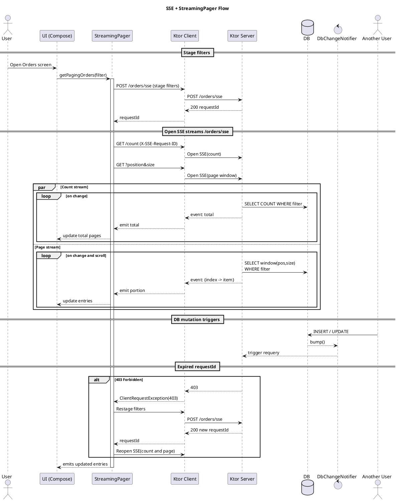

## Streaming Pagination with SSE and Ktor using StreamingPager

If you’ve ever built an app that displays a list of orders, messages, trades, or logs, you know the pain: data keeps
changing on the backend, while your UI gets stale unless you constantly re-fetch and refresh. Classic pagination with
“page N, cache it, and repeat” works fine for static datasets — but in real-time scenarios it quickly becomes clunky,
inefficient, and error-prone.

This article walks through a better approach: combining Server-Sent Events (SSE) with a StreamingPager to keep your
paginated lists always fresh, without the headaches of manual polling or cache invalidation. We’ll build it step by step
using Ktor on the server and Kotlin Multiplatform on the client, so you can apply the same pattern across Android, iOS,
Desktop, and Web.

By the end, you’ll have a working demo where the server continuously pushes changes to the client, and your UI updates
automatically as new data arrives — smooth, efficient, and almost magical.

- **Ktor SSE** on the server to push updates when data changes
- **Ktor client SSE** on the client to consume those updates
- **StreamingPager** from `ua.wwind.paging:paging-core` to maintain an always‑fresh paged list in memory

We’ll use an Orders example where the server continuously inserts random orders. The client keeps a paginated list in
sync, including filters. The approach is Kotlin Multiplatform friendly.

## Demo repository

You can find the complete runnable example
here: [xelon-ua/streaming-paging-demo](https://github.com/xelon-ua/streaming-paging-demo).

### Why SSE for pagination?

- **Push, not pull**: Server‑Sent Events keep a single lightweight HTTP connection over which the server streams updates
  as they happen.
- **Simplicity**: Unlike WebSockets, SSE is unidirectional and rides over HTTP; it’s easy to secure, proxy and observe.
- **Fits paging**: You can stream total counts and specific portions (windows) of a list whenever the underlying data
  changes.

## Architecture Overview

1) The client sends its current filters once and receives a short‑lived ID.

2) The client opens two SSE streams with that ID in a header:
    - `GET /orders/sse/count` streams the total item count.
    - `GET /orders/sse?position=X&size=Y` streams the current page as a map of `index -> item`.

3) When the database changes, the server pushes fresh values to both streams.

4) On the client, **StreamingPager** merges these streams into a single `PagingData`, preloads, and updates visible
   pages automatically.

## Flow Diagram

The sequence diagram below shows the end‑to‑end flow: staging filters, opening two SSE streams (count and page), updates
on DB change, and automatic restaging on `403`.



## Server: Ktor SSE endpoints

The server uses Ktor’s `SSE` plugin and an in‑memory H2 database (via Exposed). A simple `DbChangeNotifier` emits a
version bump on each mutation; query flows re‑emit when the version changes.

Key ideas:

- Stage filters once via `POST /orders/sse` and return a `requestId`.
- Validate that `requestId` on each SSE request via the `X-SSE-Request-ID` header.
- Stream count and pages as flows that requery when DB version changes.

```kotlin
// Server: SSE routes (excerpt)
route("/orders") {
    // 1) Stage current filters and return a short-lived requestId
    post("/sse") { /* save raw JSON filters -> respond(id) */ }

    // 2) Stream total count for these filters
    route("/sse/count", method = HttpMethod.Get) {
        sse {
            val filter = call.extractOrderFilter(cache) ?: return@sse
            repo.countAllFlow(filter).collect { total ->
                send(total.toString())
            }
        }
    }

    // 3) Stream a portion (page) as index->row JSON
    route("/sse", method = HttpMethod.Get) {
        sse {
            val filter = call.extractOrderFilter(cache) ?: return@sse
            val position = call.request.queryParameters["position"]?.toIntOrNull() ?: 0
            val size = call.request.queryParameters["size"]?.toIntOrNull() ?: 30

            repo.pageFlow(position, size, filter).collect { items ->
                // Build a JSON map of index -> item for the current window
                val map = items.mapIndexed { idx, o -> (position + idx) to o }.toMap()
                send(Json.encodeToString(map))
            }
        }
    }
}
```

Notes:

- `SseFilterCache` keeps staged filters by `requestId` with a TTL. In production, use a dedicated external store (e.g.,
  Redis or a database table) instead of an in‑memory cache to survive restarts, support horizontal scaling, and enforce
  TTLs consistently. If the `requestId` is expired or unknown, respond `403` to force the client to restage.
- `countAllFlow` and `pageFlow` re‑run queries on each `DbChangeNotifier.bump()` and stream updated results.

The server’s job is simple but powerful: keep track of filters, validate requests, and stream live updates when the
database changes. No polling, no heavy lifting — just fresh data over a lightweight HTTP channel.

## Client: Ktor SSE + StreamingPager

On the client, we:

- Stage filters and remember `requestId`.
- Maintain two SSE flows: total count and page window.
- Feed these flows to `StreamingPager(readTotal, readPortion)`.
- If the server returns `403` (expired `requestId`), we transparently restage and resume.

```kotlin
// Client: network datasource (excerpt)
class OrdersNetworkDataSource(
    private val baseUrl: String = "http://localhost:8082",
) {
    suspend fun stageSseFilters(filter: OrderFilter = OrderFilter()): String { /* POST /orders/sse */
    }

    fun totalCountFlow(requestId: String): Flow<Long> = flow {
        client.sse({ /* GET /orders/sse/count, header X-SSE-Request-ID */ }) {
            incoming.collect { event ->
                event.data?.toLongOrNull()?.let { emit(it) }
            }
        }
    }

    fun ordersPortionFlow(position: Int, size: Int, requestId: String): Flow<Map<Int, Order>> = flow {
        client.sse({ /* GET /orders/sse?position&size, header X-SSE-Request-ID */ }) {
            incoming.collect { event ->
                val map: Map<String, Order> = Json.decodeFromString(event.data ?: return@collect)
                emit(map.mapKeys { it.key.toInt() })
            }
        }
    }
}
```

Integrating with StreamingPager:

```kotlin
// Client: repository (excerpt)
@OptIn(ExperimentalStreamingPagerApi::class)
fun getPagingOrders(filter: OrderFilter): Flow<PagingData<Order>> {
    val requestIdMutex = Mutex()
    var stagedRequestId: String? = null

    suspend fun requestId(): String = requestIdMutex.withLock {
        stagedRequestId ?: dataSource.stageSseFilters(filter).also { stagedRequestId = it }
    }

    return StreamingPager(
        scope = scope,
        readTotal = {
            flow {
                var id = requestId()
                try {
                    dataSource.totalCountFlow(id).collect { emit(it.toInt()) }
                } catch (e: ClientRequestException) {
                    if (e.response.status == HttpStatusCode.Forbidden) {
                        requestIdMutex.withLock { stagedRequestId = null }
                        id = requestId()
                        dataSource.totalCountFlow(id).collect { emit(it.toInt()) }
                    } else throw e
                }
            }
        },
        readPortion = { position, size ->
            flow {
                var id = requestId()
                try {
                    dataSource.ordersPortionFlow(position, size, id).collect { emit(it) }
                } catch (e: ClientRequestException) {
                    if (e.response.status == HttpStatusCode.Forbidden) {
                        requestIdMutex.withLock { stagedRequestId = null }
                        id = requestId()
                        dataSource.ordersPortionFlow(position, size, id).collect { emit(it) }
                    } else throw e
                }
            }
        },
        config = StreamingPagerConfig(loadSize = 30, preloadSize = 60, cacheSize = 300),
    ).flow
}
```

What `StreamingPager` does here:

- Calls `readTotal()` to learn and react to total size changes over time.
- Calls `readPortion(position, size)` as the user scrolls; each flow can emit repeatedly when the server pushes updates.
- Maintains an in‑memory map of `index -> EntryState` and handles preloading and caching.

On the client, we now have flows for total count and page windows, all wrapped by StreamingPager. The magic here is
resilience: if a filter expires or the connection drops, the client automatically restages and resumes.

## UI: Consuming PagingData in Compose

The UI collects `PagingData<Order>` and renders placeholders while entries are loading. Because the pager streams
updates, you get live changes without manual refresh or cache invalidation.

```kotlin
val pagingState = viewModel.paging.collectAsState()
val orders = pagingState.value
if (orders != null) {
    LazyColumn {
        items(orders.data.size) { index ->
            when (val entry = orders.data[index]) {
                is EntryState.Success -> OrderListItem(entry.value)
                else -> LoadingRow()
            }
        }
    }
}
```

Thanks to PagingData<Order> and EntryState, the UI just reacts. Placeholders are shown while loading, and rows appear as
soon as data streams in. The result is a responsive list without manual refresh logic.

## Dependency Setup

Add the library to your shared/common module:

```kotlin
dependencies {
    api("ua.wwind.paging:paging-core:2.2.1")
    // Ktor client SSE and serialization
    implementation("io.ktor:ktor-client-core:3.3.0")
    implementation("io.ktor:ktor-client-content-negotiation:3.3.0")
    implementation("io.ktor:ktor-serialization-kotlinx-json:3.3.0")
}
```

On the server module:

```kotlin
dependencies {
    implementation("io.ktor:ktor-server-core-jvm:3.3.0")
    implementation("io.ktor:ktor-server-netty-jvm:3.3.0")
    implementation("io.ktor:ktor-server-sse-jvm:3.3.0")
    implementation("io.ktor:ktor-serialization-kotlinx-json-jvm:3.3.0")
}
```

## Error handling and resilience

- **Expired filter ID (403)**: Restage filters and reopen streams transparently (see `OrdersRepository`).
- **Backpressure**: SSE delivers events as they arrive; your flows should be cheap and map/emit quickly. Heavy work
  should be offloaded.
- **Reconnection**: If the SSE connection drops, Ktor client will throw; restart the flow (StreamingPager re‑subscribes
  on demand).
- **Security**: Authenticate the staging endpoint and validate the `requestId` ownership. Consider per‑user scopes to
  avoid cross‑tenant leaks.

## When to use this pattern

- Lists that must stay up‑to‑date: orders, chats, alerts, trading ticks, audit logs.
- Expensive or impractical to poll frequently.
- Need predictable, HTTP‑friendly infra (SSE) rather than full duplex.

Consider WebSockets if you require client‑to‑server push on the same channel or binary framing. Otherwise, SSE is often
simpler and good enough.

SSE with StreamingPager isn’t a silver bullet, but for real-time lists (orders, chats, trades, alerts) it shines. If you
don’t need full-duplex or binary channels, it’s a simpler, HTTP-friendly solution that just works.

## Running the demo

- Start the server: `./gradlew :server:run` (listens on port 8082)
- Run the Compose app (Android, Desktop, or iOS) and open the Orders screen.
- Watch the list update every few seconds as new orders are inserted server‑side.

## Takeaways

- **StreamingPager** lets you express pagination as ongoing flows for total and page windows.
- **SSE** is a great fit for server‑driven pagination updates: simple, cache‑busting free, and low‑overhead.
- The combination yields a UI that is continuously fresh with minimal glue code and no manual refresh.
